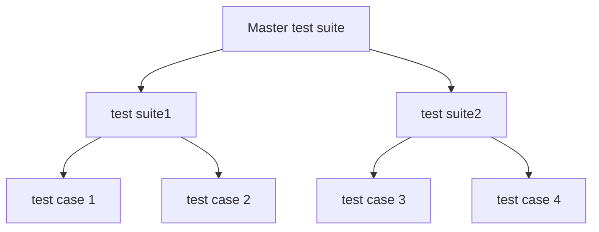

# 前言  
当写出来一个代码之后，使用一定的测试来判断代码是否正常运行，因此我们可以考虑使用一定的测试框架来检测自己的代码是否正确。接下来介绍一下boost.test框架所带来的测试框架流程。  
# 总体预览  
boost.test框架将测试代码以树的方式进行构建。boost.test称之为test tree。  
整棵树主要分为四类：  
1. 测试用例 test case  
  - 测试树中的叶子节点，包含具体的测试代码逻辑。一般而言，一个功能就对应一个测试用例。  
2. 测试套件 test suite  
  - 测试树种的内部节点，本身不包含可执行代码，但是可以绑定夹具和字测试用例或者套件。它的作用就是将各个测试用例或者是子套件注册到测试树上。
3. 主测试套件 Master Test Suite  
  - 测试树的根节点，本质是一个测试套件。绑定到主测试套件的夹具称为全局夹具。
4. 夹具（Fixtures）
  - 在测试单元（如测试用例或套件）执行前后运行的代码单元，用于环境初始化或清理。
具体树状结构如下所示：  


# 测试用例  
## 概念  
测试用例逻辑上应该满足一个功能是否如预期那边实现。一般而言，一个大的功能可以拆分为若干个小的功能，而这些小的功能就被称为测试用例。那么我们应该怎么让测试框架在执行代码时判断这个功能是否满足预期呢？答案是使用断言来判断。当测试完成之后，测试框架会生成日志或者是报告来告诉我们测试的结果。  

## 预备知识
该节主要讲述测试用例的前备知识。
### 断言  
测试断言就是告诉boost在哪里进行判断的。
1. 基础断言宏  
  + BOOST_TEST 它支持bool或者是表达式能够转化为bool，常见形式如下：  
    ``` c++
    BOOST_TEST(1 + 1 == 2);          // 布尔表达式
    BOOST_TEST(func() == expected);  // 函数返回值比较
    BOOST_TEST(var, "Optional message"); // 附带自定义错误消息
    ```
  + 严格比较 BOOST_TEST_EQ / BOOST_TEST_NE 明确值相等或者是不相等  
    ```c++
    BOOST_TEST_EQ(42, answer());     // 要求严格相等
    BOOST_TEST_NE(status, ERROR);    // 要求不等
    ```
2. 条件检测断言 
  + BOOST_TEST 通用条件检查，当检查失败时，代码继续执行  
  + BOOST_REQUIRE 致命条件检查，当检查失败时，终止当前测试用例  
  ```c++
    BOOST_REQUIRE(file != nullptr);    // 若失败，后续代码不执行
    BOOST_TEST(data.size() > 0);      // 继续执行即使失败
  ```
3. 异常断言
  + 判断是否抛出预期异常：  
  ```c++
    BOOST_REQUIRE_THROW(func(), std::runtime_error); // 必须抛出指定异常
    BOOST_CHECK_NO_THROW(safe_func());               // 不应抛出任何异常
    BOOST_CHECK_THROW(func(), std::logic_error, "Why?"); // 检查异常类型+消息
  ```
4. 浮点数近似比较，主要时处理浮点数误差的  
  ```c++
    BOOST_TEST(1.0 == 1.001, tt::tolerance(0.01));  // 允许1%误差
    BOOST_CHECK_CLOSE(result, 3.14, 0.1);           // 允许0.1%误差
  ```
5. 上下文信息增强，主要是附加调试信息  
  ```c++
    BOOST_TEST_CONTEXT("Testing scenario X") {
        BOOST_TEST(data.parse() == OK); // 失败时会显示上下文标签
    }
  ```
6. 自定义断言拓展，通过定义一个谓词，加上一个表达式，既可以判断复杂逻辑的判断  
```c++
BOOST_TEST_PREDICATE([](int x) { return x % 2 == 0; }, (value));
```
根据以上断言工具，便可以在测试用例中告诉boost，如何控制整个测试用例的运行了。

### 编程范式  
boost支持三种编程范式。  
1. 头文件格式  
  - 注意点在于，需要定义BOOST_TEST_MODULE这个宏定义，然后再包含测试框架的相关设施
  ```c++
  #define BOOST_TEST_MODULE test module name
  #include <boost/test/included/unit_test.hpp>
  ```
2. 静态库链接  
  - 第一步，所有的翻译单元都需要包含下面的头文件
  ```c++
    #include <boost/test/unit_test.hpp>
  ```
  - 第二步，有且仅有一个翻译单元是如下格式  
  ```c++
    #define BOOST_TEST_MODULE test module name
    #include <boost/test/unit_test.hpp>
  ```
  - 第三步，链接boost的静态库  
  此方法的缺点：会增大二进制文件的大小。
3. 动态库链接  
  - 第一步，所有翻译单元均需要包含如下两行
  ```c++
    #define BOOST_TEST_DYN_LINK
    #include <boost/test/unit_test.hpp>
  ```
  有且仅有一个翻译单元满足如下三行
  ```c++
    #define BOOST_TEST_MODULE test module name
    #define BOOST_TEST_DYN_LINK
    #include <boost/test/unit_test.hpp>
  ```
  - 第二步，链接boost的动态库

### 注册方式  
boost支持两种注册方式，一种是手动注册，一种是自动注册，由于手动注册属于定制化较高的，需要精准控制整个测试的运行过程，本文不涉及。

## 场景  
目前boost支持三种测试场景：  
1. 无参测试用例。  
2. 有参测试用例。  
3. 带有模板的测试用例。  
本文仅仅涉及前两个场景，第三个请参考boost官方文档。  

### 无参测试用例  
前面提到过，boost是通过测试树来管理所有的测试用例的。本文主要讲述自动注册范例。主要使用宏定义`BOOST_AUTO_TEST_CASE`来实现，它被设计为类似为不写函数返回值的函数定义的方式。
```c++
#define BOOST_TEST_MODULE example
#include <boost/test/included/unit_test.hpp>

BOOST_AUTO_TEST_CASE( free_test_function )
/* Compare with void free_test_function() */
{
  BOOST_TEST( true /* test assertion */ );
}
```
在测试用例中，包含了若干个断言，宏定义后面就是这个测试用例的名称，这个会在测试日志中显示出来。

### 有参数测试用例  
在有一些测试用例中，我们想测试一个函数在不同的输入参数下都具有符合预期的结果。在这种情况下，一个自然的想法就是自己写一些实际参数，然后依次调用后传入到函数之后，再进行判断。但是这种很多时候比较累，也不全面，而boost提供了自动生成测试数据集，将这些数据挨个传入测试函数。当然也可以自定义数据集。  
因此，先看看boost是如何定义数据集的。
#### 数据集  
数据集中“样本(Sample)”的定义与特性
1. 核心概念
  - 样本(Sample) 是一种多态元组(polymorphic tuple)，即可以容纳不同类型的元素组合。
  - 元组的长度直接定义为样本的元数(arity)，即样本中包含的元素数量。
2. 作用
  - 通过多态元组的结构，单个样本可以灵活地封装测试所需的多维输入数据（例如：(int, string, float) 三者组合）。
  - 元数(arity) 明确了每次测试时需要的参数个数，例如：
    -元数为2的样本：(input_value, expected_result)
    -元数为3的样本：(x, y, expected_sum)
3. 与数据集(Data Dataset)的关系
  - 数据集是由多个样本构成的集合，用于参数化测试（如迭代测试同一逻辑的不同输入组合）。  

以采样汽车运动数据为例说明数据集，样本，以及元数的概念。假设我们需要测试一辆汽车在一段时间内的位置，速度，加速度，假设这三个都是我们可以直接使用传感器测量到的，那么每一次测量都有位置、速度、加速度，这一次就叫做采样；而一次采样包含了位置、速度、加速度这三种类型的信息，这叫做元数，这个例子中元数为3，假设我们不测量加速度了，那么元数是2；而这一段时间内所有的采样就是数据集。  
在boost中，数据集需要满足三个功能：  
+ 可向前迭代的，即这个类型支持operator++运算符。
+ 需要实现size函数，返回这个数据的所包含的元素个数。  
+ 可以访问到类内定义的一个枚举，arity，表示多少个元数。  

而为了实现数据集的功能，数据集需要定义如下接口函数：  
1. iterator begin()，返回指向数据集中第一个样本的向前迭代器。至于向前迭代器的功能可参考cppreference中的定义。
2. boost::unit_test::data::size_t size() const函数  
  - 返回数据集的大小，其返回值类型为 boost::unit_test::data::size_t（专有类型）。
  - 返回值可能是有限值（如 10）或表示无限数据集（如 boost::unit_test::data::infinite）。
3. enum arity
  - 表示数据集中每个样本的元数（arity），即样本包含的元素个数
  - 一般来说，还需要这个数据集进行模板特化，这样boost就可以通过模板萃取读取到这个类了。
  ```c++
    boost::unit_test::data::monomorphic::is_dataset
  ```
  - 其条件是  
```c++
    boost::unit_test::data::monomorphic::is_dataset<D>::value
```  

boost官方例程  
```c++
#define BOOST_TEST_MODULE dataset_example68
#include <boost/test/included/unit_test.hpp>
#include <boost/test/data/test_case.hpp>
#include <boost/test/data/monomorphic.hpp>
#include <sstream>

namespace bdata = boost::unit_test::data;

// Dataset generating a Fibonacci sequence
class fibonacci_dataset {
public:
    // the type of the samples is deduced
    enum { arity = 1 };

    struct iterator {

        iterator() : a(1), b(1) {}

        int operator*() const   { return b; }
        void operator++()
        {
            a = a + b;
            std::swap(a, b);
        }
    private:
        int a;
        int b; // b is the output
    };

    fibonacci_dataset()             {}

    // size is infinite
    bdata::size_t   size() const    { return bdata::BOOST_TEST_DS_INFINITE_SIZE; }

    // iterator
    iterator        begin() const   { return iterator(); }
};

namespace boost { namespace unit_test { namespace data { namespace monomorphic {
  // registering fibonacci_dataset as a proper dataset
  template <>
  struct is_dataset<fibonacci_dataset> : boost::mpl::true_ {};
}}}}

// Creating a test-driven dataset, the zip is for checking
BOOST_DATA_TEST_CASE(
    test1,
    fibonacci_dataset() ^ bdata::make( { 1, 2, 3, 5, 8, 13, 21, 35, 56 } ),
    fib_sample, exp)
{
      BOOST_TEST(fib_sample == exp);
}
```  

#### 声明和注册带参数的测试用例
首先看看与前面`BOOST_AUTO_TEST_CASE`相似的声明测试用例的宏是`BOOST_DATA_TEST_CASE`和`BOOST_DATA_TEST_CASE_F`,前面的不带夹具，后面带一个夹具。啥是夹具呢，可以简单里面为测试用例所需要的环境，比如有些代码需要再特定的条件下，否则它就不会正常工作。

声明有参数的参数用例数据  
```c++
BOOST_DATA_TEST_CASE(test_case_name, dataset) { /* dataset1 of arity 1 */ }
BOOST_DATA_TEST_CASE(test_case_name, dataset, var1) { /* datasets of arity 1 */ }
BOOST_DATA_TEST_CASE(test_case_name, dataset, var1, ..., varN) { /* datasets of arity N  */ }

BOOST_DATA_TEST_CASE_F(fixture, test_case_name, dataset) { /* dataset1 of arity 1 with fixture */ }
BOOST_DATA_TEST_CASE_F(fixture, test_case_name, dataset, var1) { /* dataset1 of arity 1 with fixture */ }
BOOST_DATA_TEST_CASE_F(fixture, test_case_name, dataset, var1, ..., varN) { /* dataset1 of arity N with fixture */ }
```
前面已经说了数据集了，那么如何使用数据集中的单次采样中的各个维度的数呢，boost借助了一种类似与结构化绑定的概念，将各个各个维度的数声明为var1~varN,就已经把这些采样的数值获取到了。而第一种我们没有添加，boost默认使用sample作为获取实际数值的接口。
第二种只是添加了夹具，与前面的并无区别。

__核心机制__:  
1. 批量生成测试用例  
  - 与BOOST_AUTO_TEST_CASE（声明单个测试用例）不同，BOOST_DATA_TEST_CASE 会根据数据集中的样本数量动态注册多个测试用例，每个用例对应一个样本。
  - 若数据集有 5 个样本，则注册 5 个独立测试用例  
2. 命名规则
  - 生成一个名为 test_case_name 的测试套件（Test Suite）。
  - 套件内的每个测试用例按样本索引命名，格式为 _0, _1, ..., _N-1（N 为数据集大小）
  ```shell
    test_case_name/_0  → 样本0的测试
    test_case_name/_1  → 样本1的测试
  ```
3. 关键优势  
  1. 精准定位失败样本，日志中会明确标识失败的样本索引（如 test_case_name/_3 failed），并输出该样本的具体值，加速调试。
  2. 灵活的测试控制  
    - 命令行筛选：支持单独运行特定样本或子集
  ```shell 
    ./test_program --run_test=test_case_name/_2
  ```
  3. 装饰器应用: 
    - 可为每个样本的测试用例单独附加标签（如 @timeout）。  
  4. 执行隔离性:
    - 样本间的测试相互独立：某个样本失败不会影响其他样本的执行。

#### 数据集的操作  
数据集支持三种操作：
1. 顺序结合，使用operator+  
  - 作用：将多个数据集按顺序串联，形成一个更长的新数据集。
  - 行为：新数据集包含所有输入数据集的样本，依次排列。
  - 示例：
  ```c++
    auto ds1 = data::make({1, 2});          // 数据集1: [1, 2]
    auto ds2 = data::make({"a", "b", "c"}); // 数据集2: ["a", "b", "c"]
    auto combined = ds1 + ds2;              // 结果: [1, 2, "a", "b", "c"]
  ```
  - 适用场景：需要合并多个独立数据集的样本（如测试不同数据类型的组合）。
2. 压缩结合，使用operator^ 
  - 作用：将多个数据集的样本按索引逐对拼接（类似拉链效果）。
  - 行为：新数据集的每个样本是各输入数据集对应索引位置的组合。
  - 长度限制：以最短输入数据集为准，多余样本被截断。
  - 示例：
  ```c++
    auto ds1 = data::make({1, 2, 3});       // 数据集1: [1, 2, 3]
    auto ds2 = data::make({"x", "y"});      // 数据集2: ["x", "y"]
    auto zipped = ds1 ^ ds2;                // 结果: [(1,"x"), (2,"y")]
  ```
  - 适用场景：需要一对一关联不同数据集的样本（如输入与期望输出的配对测试）。
3. 笛卡尔积，Cartesian products with operator*
  - 作用：生成所有可能的样本组合（即笛卡尔积）。
  - 行为：新数据集的每个样本是各输入数据集样本的全排列组合。
  - 长度计算：若输入数据集大小为 A 和 B，则结果大小为 A * B。
  - 示例：
  ```c++
    auto ds1 = data::make({1, 2});          // 数据集1: [1, 2]
    auto ds2 = data::make({"a", "b"});      // 数据集2: ["a", "b"]
    auto product = ds1 * ds2;               // 结果: [(1,"a"), (1,"b"), (2,"a"), (2,"b")]
  ```
  - 适用场景：需要覆盖所有参数组合的测试（如边界值交叉验证）

#### 数据集的生成器  
1. 单例生成器（Singletons）
  - 生成仅包含单个值或固定值组合的小型数据集。
  - 适用场景：测试特定边界值或常量输入。
  - 使用方法

  ```c++
    #include <boost/test/data/test_case.hpp>
    namespace bdata = boost::unit_test::data;
    // 生成单值数据集
    auto single_val = bdata::make(42);          // 数据集: [42]
    auto tuple_val  = bdata::make(1, "test");   // 数据集: [(1, "test")]
  ```  

  - 特点  
    + 元数（arity）由参数数量决定（如 make(1, 2) 的元数为 2）。
2. 容器/C数组生成器
  - 从 STL 容器（如 vector、list）或 C 风格数组生成数据集。
  - 适用场景：复用现有数据容器进行测试。
  - 使用方法

  ```c++
    std::vector<int> vec = {10, 20, 30};
    int c_array[] = {100, 200};

    auto ds_vec = bdata::make(vec);      // 数据集: [10, 20, 30]
    auto ds_arr = bdata::make(c_array);  // 数据集: [100, 200]
  ```  

  - 特点
    + 自动推导元数（容器元素类型决定）。
    + 支持双向迭代器（如 std::list）。
3. 范围序列生成器（Ranges/Sequences）
  - 生成线性序列（类似 Python 的 range）。
  - 适用场景：生成连续整数或浮点数序列。
  - 使用方法

    ```c++
      auto ds_range = bdata::xrange(1, 5);       // 数据集: [1, 2, 3, 4]
      auto ds_step  = bdata::xrange(0, 10, 2);   // 数据集: [0, 2, 4, 6, 8]
      auto ds_float = bdata::xrange(0.5, 2.0, 0.5); // 数据集: [0.5, 1.0, 1.5]
    ```

  - 参数说明
    + start：起始值（包含）。
    + stop：结束值（不包含）。
    + step：步长（可选，默认为 1）。

4. 随机数生成器（Random Numbers）
  - 生成服从特定分布的随机数序列。
  - 适用场景：压力测试或随机输入验证。
  - 使用方法

    ```c++
      // 生成均匀分布的随机整数 [0, 100)
      auto rand_int = bdata::random(0, 100) ^ bdata::xrange(5); // 5个随机数

      // 生成正态分布的随机浮点数 (均值=0.0, 标准差=1.0)
      auto rand_normal = bdata::random(
          bdata::distribution=std::normal_distribution<>(0.0, 1.0)
      ) ^ bdata::xrange(3); // 3个样本
    ```  

  - 支持的分布
    + uniform_int_distribution
    + normal_distribution
    + 其他 C++ <random> 库中的分布类型。

5. 无限数据集生成器  

# 测试套件  
如果测试用例相当于测试树的叶子，那么测试套件就相当测试树的树干。boost可以没有测试套件，而仅仅只需要测试用例，但是有了测试套件，能够更好的管理整个测试用例的运行。测试套件分为两种：
  + 自动注册
  + 手动注册

而测试套件中最重要的是`master test suite`。  
本文先主要讲述自动注册的相关流程。  
## 测试套件的自动注册流程  
测试套件类似于c++中命名空间的概念。它以`BOOST_AUTO_TEST_SUITE`作为开始，`BOOST_AUTO_TEST_SUITE_END`作为结束的地方。整体流程如下：  
```c++
BOOST_AUTO_TEST_SUITE(test_suite_name);
BOOST_AUTO_TEST_SUITE_END();
```
在开始和结束之间定义的测试套件和测试用例就是测试套件的成员。而测试用例是最接近的测试套件的成员，所有的测试套件都是主测试套件的成员。  
__主要特性__:测试套件可以像命名空间那样，开始-结束，在开始-再结束  
```c++
#define BOOST_TEST_MODULE example
#include <boost/test/included/unit_test.hpp>

BOOST_AUTO_TEST_SUITE( test_suite )

BOOST_AUTO_TEST_CASE( test_case1 )
{
  BOOST_ERROR( "some error 1" );
}

BOOST_AUTO_TEST_SUITE_END()


BOOST_AUTO_TEST_CASE( test_case_on_file_scope )
{
  BOOST_TEST( true );
}

BOOST_AUTO_TEST_SUITE( test_suite )

BOOST_AUTO_TEST_CASE( test_case2 )
{
  BOOST_ERROR( "some error 2" );
}

BOOST_AUTO_TEST_SUITE_END()
```
如上所示。  

## 主测试套件  
根据前文"概述"部分的定义，主测试套件（master test suite）是测试树结构的根节点。使用本单元测试框架构建的每个测试模块，其内部始终维护着一个（唯一的）主测试套件实例。框架内部自动管理该主测试套件，所有其他测试单元均以直接或间接子节点的形式注册于主测试套件之下。  
```c++
namespace boost {
namespace unit_test {
class master_test_suite_t : public test_suite
{
  /// implementation details
public:
  int argc;
  char** argv;
};

} // namespace unit_test
} // namespace boost
```  
### 如何获取命令行参数  
要访问主测试套件的单个实例，请使用以下界面：  
```c++
namespace boost {
namespace unit_test {
namespace framework {

master_test_suite_t& master_test_suite();

} // namespace framework
} // namespace unit_test
} // namespace boost
```  
命令行参数接口：  
```c++
boost::unit_test::framework::master_test_suite().argc;
boost::unit_test::framework::master_test_suite().argv;
```  

### 如何修改主测试套件名称  
主测试套件名称默认为 Master Test Suite
1. 通过宏`BOOST_TEST_MODULE`, 通过重新定义这个宏就可以重新初始化，当定义这个宏之后，就自动产生了一个初始化函数。  
2. 通过测试模块的初始化函数。通过重新定义这个初始化函数就可以达到相应的效果。  
    ```c++
      #include <boost/test/included/unit_test.hpp>
      using namespace boost::unit_test;

      BOOST_AUTO_TEST_CASE( free_test_function )
      {
        BOOST_TEST( true /* test assertion */ );
      }

      test_suite* init_unit_test_suite( int /*argc*/, char* /*argv*/[] )
      {
        framework::master_test_suite().p_name.value = "my master test suite name";
        return 0;
      }
    ```  
如果没有定义BOOST_TEST_MAIN和BOOST_TEST_MODULE标志，则必须手动实现测试模块初始化功能。主测试套件名称可以在此功能中的任何点重置。