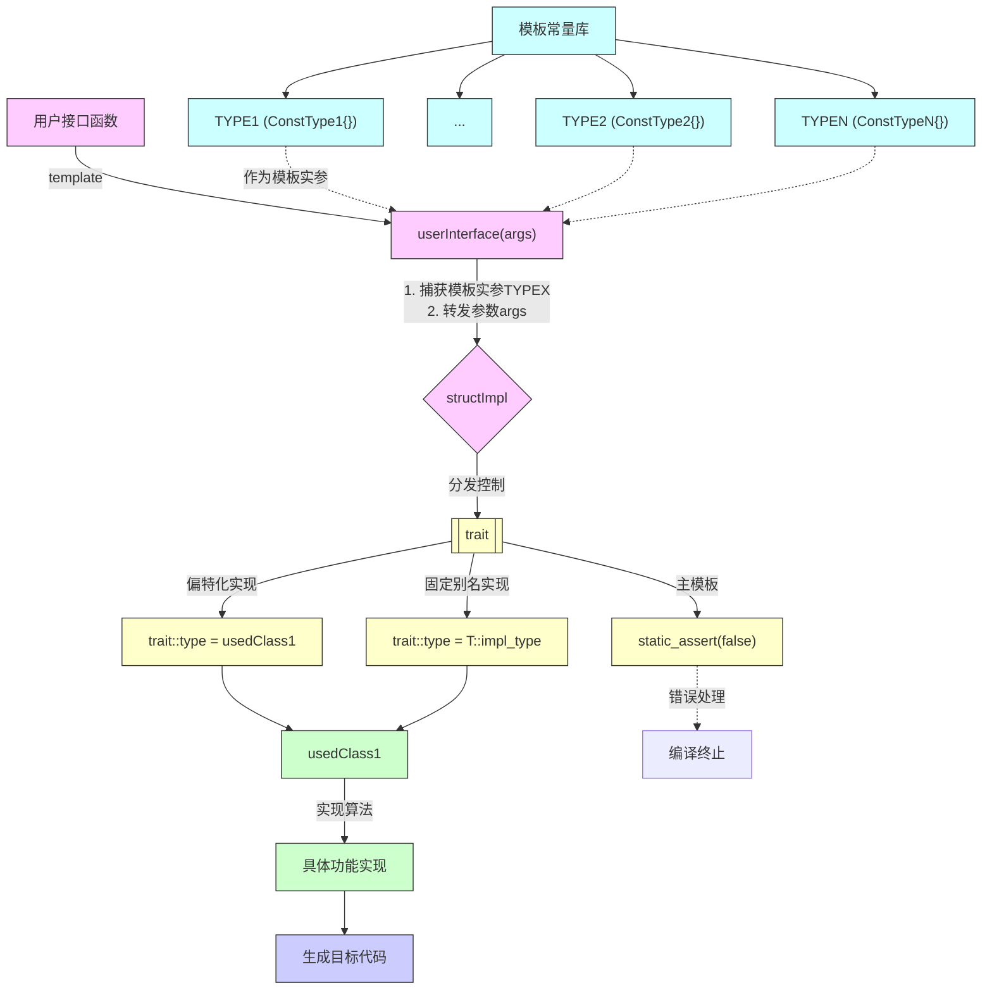

## 一、前言

当我们想要对多种类型实现同样的接口，那么最先想到的是重载这个函数，根据接口来让编译器自动选择。今天将一个比较常见的技巧，就是标签派发，它也能实现类似重载的效果。

## 二、主要结构 

先来看看标签派发是如何设计出来，从而解决这个这个问题的。首先有不同的函数表现，也就是说，对于类A，函数接口func，它有A的效果，对于类B，函数接口func有B的作用效果。但是类A和类B之间不一定有父子关系，那么这个时候使用虚函数的方式就没办法解决。那么首先解决的问题是，func如何识别出一个参数的类型到底是A还是B呢？c++中可以使用模板来获取类型。

接下来又有一个新的问题，就是func确实可以在编译器处理的时候识别到类型，然后根据类型选择不同的函数，但是，我们是先写函数模板，然后再被编译器处理，也就说我们是在前面被处理的。那么可以这样预想，当编译器拿到类型信息之后，如果我们能够设计一个结构，它能够根据实际的类型，然后仿照一般变量的方式利用if-else来进行判断的话，然后在这个函数内部来实现分发。

因此接下来就是两个问题：
+ 用什么来标识这些不同的情况呢？
+ 用什么来实现if-else这样的判断效果呢？

### 2.1 可行性设计

有些大佬提出了这样的构想。假设有一个类型变量T，首先要解决这个类型变量的常量值是哪些？类比一般int类型，它的常量值是0，1，2···N的整数。而模板函数中天然有模板变量T，现在要做的是设计这个常量值。假设这个变量在我写代码的时候就知道了，那么是不是就可以认为是常量。

那么就预先定义一些类型，比如:

```c++
struct ConstType1 {};
struct ConstType2 {};
struct ConstType3 {};
struct ConstType4 {};
```

现在似乎是解决了第一个问题，就是标识了这些不同的情况。但是具体实际应用，不可能这么简单的类实现，那么怎么把这些预先定义的常量和实际使用的类型相关联呢？这个先留着。

接下来设计第二个问题，那就是怎么实现类型的if-else判断语法呢？

在[c++参数推导](./2025-06-25-c++模板参数推导和模板实例化.md)中，可以使用偏特例化，既保持泛型的效果，又可以达到约束的效果。想一下，if-else最终实现的效果和模板约束效果是不是可以等价。如果我们能够将这个约束效果放到偏特化中，那么是不是就达到了对类型的if-else筛选效果。

当然，为了和前面的类型常量联合起来，我们可以如下构造：
```c++
template <typename RealType, typename = GetTypeOfTag<RealType>>
struct funcImpl_t{
    static void funcImpl(RealType&& Val) {
        std::cout << "default impl\r\n";
    }
}

template <typename RealType>
struct funcImpl_t <RealType, ConstType1> {
    static void funcImpl(RealType&& Val) {
        std::cout << "ConstType1\r\n";
    }
}

template <typename RealType>
struct funcImpl_t <RealType, ConstType2> {
    static void funcImpl(RealType&& Val) {
        std::cout << "ConstType2\r\n";
    }
}

template <typename RealType>
struct funcImpl_t <RealType, ConstType3> {
    static void funcImpl(RealType&& Val) {
        std::cout << "ConstType3\r\n";
    }
}

```

这里说明一下，主模板中的默认参数中的GetTypeOfTag还没有实现，但是这里只是表示一个功能，就是可以过去模板参数的tag。那么，当我们使用如下方式：

```c++
template <typename T>
void func1(T val) {
    funcImpl_t<T>::funcImpl(val);
}
```

`funcImpl_t<T>`这个是不是达到了if-else,或者换句话说，就是`switch(var)`的结构。这些类模板的偏特化版本就达到了`case constval1:`的效果。根据偏特化的结果，它就会根据实际传入的类型模板变量实参所关联的tag选择对应的函数实现。

那么如何实现`GetTypeOfTag<RealType>`这个函数的功能呢？就是输入一个类型变量，输出一个常量的效果。在[c++参数推导](./2025-06-25-c++模板参数推导和模板实例化.md)中，我们提到了推导形参，它需要根据传入的模板实参来得到，那么是不是在这里我们可以利用这个来实现呢。

首先设计一个通用的类模板，这样就达到了`GetTypeOfTag`相同函数名的效果。如下所示

```c++

template <typename T>
struct TraitType {
    using type = T::tag;
}

class usedClass1 {
public:
    using tag = ConstType1;
}
```

这样原来的主模板就可以实现为

```c++
template <typename RealType, typename = TraitType<RealType>::type>
struct funcImpl_t{
    static void funcImpl(RealType&& Val) {
        std::cout << "default impl\r\n";
    }
}
```

所以这里也就完成了`GetTypeOfTag`函数的功能。总体代码设计为:

```c++
struct ConstType1 {};
struct ConstType2 {};
struct ConstType3 {};
struct ConstType4 {};

template <typename T>
struct TraitType {
    using type = typename T::tag;
};

class usedClass1 {
public:
    using tag = ConstType1;
};

template <typename RealType, typename s = typename TraitType<RealType>::type>
struct funcImpl_t{
    static void funcImpl(RealType& Val) {
        std::cout << "default impl\r\n";
    }
};

template <typename RealType>
struct funcImpl_t <RealType, ConstType1> {
    static void funcImpl(RealType& Val) {
        std::cout << "ConstType1\r\n";
    }
};

template <typename RealType>
struct funcImpl_t <RealType, ConstType2> {
    static void funcImpl(RealType& Val) {
        std::cout << "ConstType2\r\n";
    }
};

template <typename RealType>
struct funcImpl_t <RealType, ConstType3> {
    static void funcImpl(RealType& Val) {
        std::cout << "ConstType3\r\n";
    }
};

template <typename T>
void func1(T val) {
    funcImpl_t<T>::funcImpl(val);
};

int main() {
    usedClass1 ff;
    func1(ff);
    return 0;
}
```

### 2.2 实际设计方案

根据上一节的内容，主要的实现流程可总结如上。

1. 设计模板常量TYPE1、TYPE2...TYPEN
    + 如上面例子中的 `struct ConstType1 {};struct ConstType2 {};struct ConstType3 {};struct ConstType4 {};`。
2. 设计用户接口函数，userInterface
    + 需要使用模板函数，从而获取传入变量的模板实参。
    + 将变量实参和模板实参同时传递给具体实现的类模型structImpl。
3. 设计具体实现类usedClass1与模板常量的绑定方式，以及具体实现类usedClass1与萃取接口函数绑定的方式。
    + 实现一：设计一个模板类trait，然后读取类中固定类型别名，然后把这个类型赋值给名为type的类型别名。
    + 实现二：设计一个主模板类trait，其内部没有type的类型别名，然后偏特化实现，type值定为想要绑定的类型别名。
4. 根据第三步设计的绑定方式，将具体实现类的模板参数同步转发，并使用萃取接口萃取实际传入的类型绑定的模板常量。
    + 实现方式一般为默认值。
    + 内部需要有一个静态接口函数接口，一般实现为使用静态断言false，表示没有特化成功。或者是该模板没有实现响应的接口。
5. 根据structImpl依次特化模板常量TYPE1、TYPE2...TYPEN，然后重新实现主模板中的接口函数。

主要实现的伪码如下

```c++

template<typename T>
void interfaceUser(T val)
{
    switch (GetTypeOfTag<T>)
    {
    case ConstType1:
        funcImpl_t<T, ConstType1>::funcImpl(val);
    break;
    case ConstType2:
        funcImpl_t<T, ConstType1>::funcImpl(val);
    break;
    case ConstType3:
        funcImpl_t<T, ConstType1>::funcImpl(val);
    
    break;
    case ConstType4:
        funcImpl_t<T, ConstType1>::funcImpl(val);
    break;
    case ConstType5:
        funcImpl_t<T, ConstType1>::funcImpl(val);
    break;
    default:
        static_assert(0, "error message!");
    break;
    }
}

```

关系图如下：



## 三、impl获取信息的泛型实现

前面提到了根据自定义的tag来匹配响应的算法实现，但是这里引入了另外一个问题，那就是，写算法的时候，我只知道这个tag，其他信息全然不止。那么写算法的时候就开始懵逼了，给我传进来一个黑盒子，这咋玩啊？想一下，如果想要访问这个对象的信息，一般有三种方式：
+ 通过obj.data访问数据成员
+ 通过obj.memberFunc()获取
+ 通过友元来获取类信息

先说说第一个，我们需要指定类的已经定义好的数据成员名，那么这个时候有一个问题。算法和类是单独分开的，一拨人设计泛型算法、一拨人开发类的。算法对开发说，你必须给我开放出这个类的数据成员，然后它咋咋咋，开发心里想这么多事。所以这个不太妙。另外一个缺点是，类必须暴露出数据成员，设计类时比较膈应，对类的设计限制比较大。

然后说第二个，通过成员函数访问，这个比上面哪个好一些，但是也有同样的问题，开发就是不像暴露这个共有接口呢。

第三个，使用友元的方式达到效果。这个感觉怎么也有上面的问题呢？但是算法表示，你总不能不给我信息吧！想要使用我这个算法的，要实现这个接口的数据，然后才可以工作！看起来这个解决了前面说的两个困局，就是必须实现这个或者是那个接口，暴露风险。

### 3.1 友元优缺点分析

c++中可以使用友元函数和友元类，这两者可以各自选择是否需要模板化来实现泛型的目的。

### 3.2 友元函数

一般来说，算法端获取开发端的接口一般都是采用模板函数，因为这样就可以选择一套函数接口，便可以获取或者是设置相关信息了。如以下类型：

```c++
template<typename T>
int getInfoUsedForAlgo(const T& val) {
    static_assert(0, "should Specialize getInfoUsedForAlgo for your class");
    return 0;
}

class concreteType {
    int name = 42;
    friend int getInfoUsedForAlgo<concreteType>(const concreteType& val);
};

// 特化实现
template<>
int getInfoUsedForAlgo<concreteType>(const concreteType& val) {
    return val.name;
}
```

开发端使用模板特化的方式，来达到特化的方式。并且可以使用auto关键字来达到泛型的效果。

```c++
template<typename T>
auto getInfoUsedForAlgo(const T& val) ->decltype(auto){
    static_assert(0, "should Specialize getInfoUsedForAlgo for your class");
    return 0;
}

class concreteType {
    int name = 42;
    friend auto getInfoUsedForAlgo<concreteType>(const concreteType& val) ->decltype(auto);
};

// 如果是struct的话，就不需要声明为友元函数了，直接特化即可。

// 特化实现
template<>
auto getInfoUsedForAlgo<concreteType>(const concreteType& val) ->decltype(auto){
    return val.name;
}
```

其特点是，较为简单直接。

好处就是开发如果不想暴露数据成员，或者是共有成员函数，只需要将这个函数声明为友元函数，就可以实现数据私密。总体上来说，算法开发提出使用这个算法的要求，在一定程度上降低了算法和算法的耦合程度

### 3.3 友元类

一般而言，使用友元类肯定是为了获取偏特化的效果，因为模板函数并不具有偏特化。偏特化一般可以用于施加检测条件，特化用户的类，同时保留一定的泛型能力，从而提高自己的接口适配度。

因此常见都是使用类静态成员函数，从而不用实例化具体对象便有了访问私有成员的能力。这个时候就有了泛型接口选择了。

+ 使用普通类作为友元类，然后在类静态成员函数声明为模板函数。(boost.Serialization方案)
+ 使用类模板，然后在类静态成员函数声明为普通函数。(boost.geometry方案)

先来说说第一个方案。它的一般工作方案为

```c++

namespace detail {
struct access {
    template<typename GenericType, typename UserType>
    static void getData(GenericType t1, UserType t2) {
        t2.serilize(t1);
    }
};
};

class concreteType {
    friend class detail::access;
    int name = 42;

    template<typename T>
    void serilize(T & t1) {
        t1 & this->name;
    }
};

struct ReadType {
    int c;

    void operator & (int val) {
        c = val;
    }
};
```

也就是说，它实例化一个具体的类，然后达到不同类型数据获取数据的效果。

---------------------------------------------

第二种，使用类模板达到泛型，然后定义通过的静态成员函数的方式达到效果。

```c++
namespace detail {

template<typename UserType>
struct access {
    static auto getData(UserType t2) ->decltype(auto){
        static_assert(0, "should Specialize getInfoUsedForAlgo for your class");
        return 0;
    }
};
};

class concreteType {
    template<T>
    friend class detail::access;
    
    int name = 42;
};

// 用户特化模板
template<>
struct access<concreteType> {
    static auto getData(UserType t2) ->decltype(auto){
        return t2.name;
    }
};

//如果是模板类的话

template<typename T>
class concreteTypeT {
    template<T>
    friend class detail::access;
    
    int name = 42;
};

// 用户特化模板
template<T>
struct detail::access<concreteTypeT<T>> {
    static auto getData(UserType t2) ->decltype(auto){
        return t2.name;
    }
};

// 使用

template<T>
int getValue(T& t1) {
    return detail::access<T>::getData(t1);
}

```

### 3.4 总结 

1. boost.Serialization主要强调每一个具体的类都需要对这个函数进行实现，利用泛型函数来实现不同接口函数。
2. boost.geometry主要考虑到了模板类，即这样极大的降低了用户的代码可重复使用度，用户只需要对这一类模板类特化，那么就可以使用boost.geometry的哪些套件。

## 四、geometry标签分发的一个实现

既然是针对进行处理的，那么变量肯定需要是类型中的常量，假设我预先设计一个类型，比如

```c++
#include <iostream>
#include <type_traits>
#include <vector>
#include <list>

// 1. 定义标签类型
namespace geometry {
    namespace traits {
        // 主标签
        struct geometry_tag {};
        
        // 具体几何类型标签
        struct point_tag : geometry_tag {};
        struct line_tag : geometry_tag {};
        struct polygon_tag : geometry_tag {};
        struct multi_point_tag : geometry_tag {};
        struct multi_line_tag : geometry_tag {};
        struct multi_polygon_tag : geometry_tag {};
    }

    // 2. 定义特征类模板（主模板）
    template <typename Geometry>
    struct tag {
        // 默认情况下没有标签
        // 用户需要为他们的几何类型特化这个特征类
    };

    // 3. 定义一些几何类型
    template <typename T>
    struct Point {
        T x, y;
    };

    template <typename T>
    struct Line {
        Point<T> start, end;
    };

    template <typename T>
    struct Polygon {
        std::vector<Point<T>> outer;
        std::vector<std::vector<Point<T>>> inners;
    };

    // 4. 为几何类型特化标签特征
    template <typename T>
    struct tag<Point<T>> {
        using type = traits::point_tag;
    };

    template <typename T>
    struct tag<Line<T>> {
        using type = traits::line_tag;
    };

    template <typename T>
    struct tag<Polygon<T>> {
        using type = traits::polygon_tag;
    };

    // 5. 辅助类型提取
    template <typename Geometry>
    using tag_t = typename tag<Geometry>::type;

    // 6. 实现算法（使用标签派发）
    namespace dispatch {
        // 默认实现（主模板）
        template <typename Geometry, typename Tag = tag_t<Geometry>>
        struct area {
            static double apply(Geometry const&) {
                // 默认实现（可能抛出异常或静态断言）
                static_assert(sizeof(Geometry) == 0, 
                    "Not implemented for this geometry type");
                return 0;
            }
        };

        // 点特化
        template <typename Geometry>
        struct area<Geometry, traits::point_tag> {
            static double apply(Geometry const&) {
                return 0.0; // 点的面积为0
            }
        };

        // 线特化
        template <typename Geometry>
        struct area<Geometry, traits::line_tag> {
            static double apply(Geometry const&) {
                return 0.0; // 线的面积为0
            }
        };

        // 多边形特化
        template <typename Geometry>
        struct area<Geometry, traits::polygon_tag> {
            static double apply(Geometry const& geom) {
                // 简化版多边形面积计算（实际Boost.Geometry有更复杂的实现）
                double sum = 0.0;
                for (size_t i = 0; i < geom.outer.size(); ++i) {
                    size_t j = (i + 1) % geom.outer.size();
                    sum += (geom.outer[i].x * geom.outer[j].y - 
                            geom.outer[j].x * geom.outer[i].y);
                }
                return std::abs(sum) / 2.0;
            }
        };
    }

    // 7. 用户接口函数
    template <typename Geometry>
    double area(Geometry const& geom) {
        return dispatch::area<Geometry>::apply(geom);
    }
}

int main() {
    using namespace geometry;
    
    Point<double> p{1.0, 2.0};
    Line<double> l{{0.0, 0.0}, {1.0, 1.0}};
    Polygon<double> poly{
        {{0.0, 0.0}, {1.0, 0.0}, {1.0, 1.0}, {0.0, 1.0}}, // 外环
        {} // 内环
    };

    std::cout << "Point area: " << area(p) << "\n";
    std::cout << "Line area: " << area(l) << "\n";
    std::cout << "Polygon area: " << area(poly) << "\n";

    return 0;
}
```