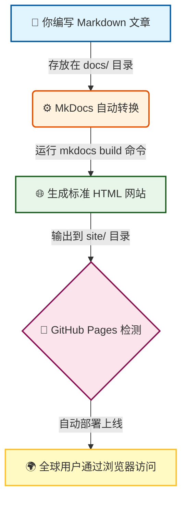

## 一、前言

当我们想把自己的文章、图片等静态资源分享给全世界时，通过建立一个网站是一个不错的方式，别人只需打开浏览器就能访问。那么这个只包含静态资源的网站就是静态网站，只需要凑齐以下三个关键元素：

1. **网站的“脸面”** ：  
    也就是用户在浏览器里看到的画面。它由 HTML（搭建骨架）、CSS（负责美化）和 JavaScript（添加互动）组成。

2. **网站的“门牌号”**:  
    也就是网站地址（URL）。只有有了它，其他人才能通过浏览器精准地找到自己的网站。

3. **网站的“仓库管理员”**:  
    也就是服务器。当浏览器请求访问时，是它在背后负责把具体的网页数据（HTML/CSS/JS）取出来，发送给用户。

由于一般人不太可能搞一个服务器，也不想自己去申请一个网址，很多就只是想把自己的内容展现出来就行了。此时GitHub提供的pages功能，它允许用户通过一定的规则来将自己的网页展现出来，其他的网址和服务器，GitHub通过一定的规则进行提供。

也不是什么网站都可以建立的，GitHub允许两类网站：

1. 个人或者是组织站点
   
2. 项目站点  

__主要区别：__

| 类型 | 仓库命名规则 | 访问网址 | 用途 |
| :--- | :--- | :--- | :--- |
| **个人/组织站点** | **必须**为 `用户名.github.io` | `https://用户名.github.io` | 你的个人主页、博客、作品集 |
| **项目站点** | **任意名称**（如你的 `xxx`） | `https://用户名.github.io/xxx` | 展示某个特定项目的文档、Demo、介绍页 |

## 二、 创建"个人/组织网站"

想拥有像 `https://username.github.io` 这样的独立域名主页吗？只需三步：

1. __新建一个“特殊”的仓库__  
      + 在 `GitHub` 点击右上角 `+ -> New repository`。
      + 关键点：仓库名必须是 `你的用户名.github.io`。  
          - 例如：你的用户名是 `superikunfan`，仓库名就必须是 `superikunfan.github.io`。
          - 确保仓库是 `Public`（公开）的。
  
2. __上传网站文件__  
    + 在这个新仓库里，上传你的 `index.html`（首页）以及其他 `CSS/JS` 文件。
    + 提示：你可以直接在线创建 `index.html` 并写入 `Hello World` 来测试。

3. __自动激活__  
    + 对于这种命名规则的仓库，`GitHub` 通常会自动开启 `Pages` 功能。
    + 几分钟后，访问 `https://你的用户名.github.io`，你的个人主页就上线啦！

## 三、仓库网站

1.  **进入任意仓库设置**
    *   打开你现有的项目仓库（比如叫 `xxx`）。
    *   点击顶部的 **"Settings"**。

2.  **开启 Pages 开关**
    *   左侧菜单找到 **"Pages"**。
    *   在 **Source** 下，选择分支（推荐 `main` 分支）和文件夹（推荐 `/ (root)` 或 `/docs`）。
    *   点击 **Save**。

3.  **等待部署**
    *   确保你选的分支根目录下有 `index.html` 或者是 `/docs` 有 `index.html`，这个是和第二步中选择 `source` 的路径所对应的。
    *   等待约 1-2 分钟，刷新页面，看到绿色提示框显示网址：`https://用户名.github.io/xxx`。

## 四、常见问题

### 1. 这个网页到底是什么？

简单来说，它就是你在仓库里指定的那个 **`index.html`** 文件（首页）。

但如果你有很多篇文章怎么办？
这时候，`index.html` 就像一个 **“目录树”的树根** 。

- 它负责把所有其他文章（子页面）串联起来，形成一个索引结构。
- 访客只要打开这个首页，就能顺着“树枝”找到你想展示的任何一篇文章或图片。
- **本质上**：它是一组相互链接的 HTML 文件集合，而 `index.html` 是入口。

### 2. 网址是啥？

一旦网站建成，GitHub 会送你一个专属门牌号：
- **个人/组织主页**：`https://用户名.github.io`
  - *（这是你的“独栋别墅”，仓库名必须叫 `用户名.github.io`）*
- **项目站点**：`https://用户名.github.io/项目名`
  - *（这是你的“项目展厅”，比如 `https://用户名.github.io/xxx`）*

### 3. 服务器呢？

**不用买！不用租！**
服务器由 **GitHub 官方免费提供**。
你只需要把代码传上去，GitHub 庞大的服务器集群就会自动帮你托管文件，并随时准备响应全球用户的访问请求。你完全不用操心服务器维护、安全补丁这些事。

### 4. GitHub 怎么知道我的网页内容更新了呢？

这是最神奇的地方！GitHub 不需要你手动点击“发布”按钮，它靠的是**“监听机制”**。

整个过程就像有一个 **24 小时待命的机器人** 在盯着你的仓库：

1.  **你提交代码**：
    当你在本地修改了文章或图片，执行 `git push` 把代码推送到 GitHub 仓库时。
2.  **触发事件**：
    GitHub 立刻检测到你的**指定分支**（比如 `main`）或**指定文件夹**（比如 `/docs`）发生了变动。
3.  **自动构建**：
    这个“机器人”会自动启动，把你最新的代码拉取下来，重新生成静态网页文件。
4.  **瞬间上线**：
    构建完成后（通常只需几十秒到两分钟），新版本的网站会自动替换旧版本。

### 5. 写 HTML 太麻烦了，有没有更简单的方式？

当然有！没人喜欢手写一堆 `
` 和 `
` 标签。

现在的最佳实践是：**专注于写内容（Markdown），让工具帮你生成网页（HTML）。**

我推荐使用 **MkDocs**。它是一个静态网站生成器，能让你像写文档一样写博客，然后自动把它变成漂亮的网站。

#### 5.1 MkDocs 是如何工作的？

你可以把 MkDocs 想象成一个**“全自动翻译官”**，它的工作流程非常简单：

1.  **准备素材（Markdown）**
    *   你在项目的 `docs/` 文件夹下存放所有的文章。
    *   这些文章不需要是复杂的 HTML，只需要是简单易读的 **`.md` (Markdown)** 文件。
    *   **入口文件**：MkDocs 默认会寻找 `docs/index.md` 作为网站的**首页**。

2.  **自动索引（导航生成）**
    *   你只需要在配置文件（`mkdocs.yml`）中简单列出文章结构或者是开启 `- navigation.tabs`，具体可参考官方。
    *   MkDocs 会自动读取 `docs/` 下的所有子目录和文件，帮你生成漂亮的**侧边导航栏**和**页面层级**，完全不用手动写链接。

3.  **一键构建（生成 HTML）**
    *   当你运行命令 `mkdocs build` 时，魔法发生了！✨
    *   MkDocs 会遍历整个 `docs/` 文件夹，把所有 `.md` 文件“翻译”成标准的 `.html` 文件。
    *   最终，它会在根目录生成一个 **`site/`** 文件夹，里面包含了完整的、浏览器能直接读懂的网站（包括 `index.html`、CSS 样式和 JS 脚本）。

4.  **GitHub Pages 接管**
    *   这时候，GitHub Pages 就不关心你原来写的是 Markdown 还是 HTML 了。
    *   它只看到 `site/` 文件夹里那个完美的 `index.html`，然后 happily 把它发布到网上！

**💡 总结一下流程：**

