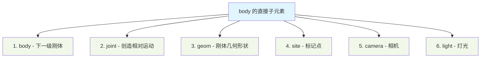
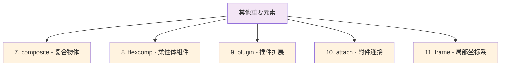

## 一、前言

多体动力学仿真中，由于mujoco平台开源免费，现如今越来越火

mujoco与gazebo相似，都使用配置文件的方式来描述仿真场景，只不过mujoco使用的是叫做mjcf格式的，它基本上就是xml上改动而来的。它的思想就是使用mjcf文件描述仿真场景，使用一定的api来控制物体运动。

一般来说，驱动一个现实环境中机器人，直观上可分为以下几部分：

1. 机械本体结构负责具体的动作承载体
2. 执行机构负责让机器动起来
3. 传感器负责检测外界情况
4. 机器人所处的外界环境，例如温度，风，摩擦力等等。

假设我们使用合适正确的方式，使用mjcf文件已经描述出了我们想要仿真的环境时，就可以使用一定的api将这个配置文件使用运行的程序读取并建立出来。一般来说，一个仿真运行大致可以分为如下步骤

1. 初始化仿真环境。
2. 仿真一直循环。
3. 结束仿真，清理环境。


对于第一步，初始化仿真环境，mujoco认为，由于描述的文件大部分情况下不会发生修改变化，而仿真过程中往往存在着一些数据会随着时间变化而变换，按照不同的类设计职责，mujoco 分为了两步，

1. 读取静态描述文件，它使用  
    ```c
    mjModel* m = mj_loadXML("mymodel.xml", NULL, errstr, errstr_sz);
    ```

2. 使用静态描述文件得到数据结构来创建合适的动态数据资源描述，它使用
    ```c
    mjData* d = mj_makeData(m);
    ```

对于第二步，mujoco使用 `mj_step`函数来推动物理引擎完成相关的计算。

```c
mj_step(m, d);
```

对于第三步，需要同时清理资源

```c
// deallocate existing mjModel
mj_deleteModel(m);

// deallocate existing mjData
mj_deleteData(d);
```

总结，想要使用mujoco进行仿真，一个是编写正确的mjcf文件，另一个就是软件端推动物理计算。

在mjcf中，前三个都有比较语义化的元素相对应

1. 机械本体 --> body
2. 执行机构 --> actuator
3. 传感器  --> sensor

对于环境元素，mjcf较为分散，而mjcf中还有其他的一级元素，也更多是方便建模而设立的。

## 二、`body` 元素

想象你要在地面上放置一台机械臂。最自然的方式是：先确定大地（全局坐标系），然后在上面逐个安装机械部件。MuJoCo 的 `worldbody` 就是这个"大地"，而每个 `body` 就是机械臂的一个个连杆。这种设计完美对应了我们的物理直觉——每个刚体都有自己独立的坐标系，且通过父子关系连接成完整的机械系统。

**`body` 作为坐标系容器**

每个 `body` 的核心功能是定义一个局部坐标系。你可以把它想象成一个"坐标容器"：在这个容器内描述的所有几何体、关节、站点等元素，都自动使用这个局部坐标系作为参考基准。比如描述机械臂的一个连杆时，你只需要关心该连杆自身的几何特征，无需考虑它在整个机械臂中的全局位置。

**树状组织结构**

MuJoCo 利用 XML 的嵌套特性，让 `body` 可以层层嵌套，形成树状结构：
```xml
<worldbody>           <!-- 大地 -->
    <body name="base">      <!-- 基座 -->
        <body name="link1"> <!-- 第一节 -->
            <body name="link2"/> <!-- 第二节 -->
        </body>
    </body>
</worldbody>
```
这种结构直观反映了机械装置的组装逻辑：父 `body` 包含子 `body`，就像基座包含第一节臂杆，第一节又包含第二节。

**默认固定与显式运动**

`MuJoCo` 采用了一个很实用的设计：默认情况下，子 `body` 与父 `body` 是固定连接的。只有当需要相对运动时，才在子 `body` 中显式添加关节（`joint`）元素。这种"默认固定，显式运动"的方式让模型描述更加简洁，因为大多数机械连接确实是固定的。

**从局部到全局的递归转换**

虽然每个元素都在各自的局部坐标系中描述，但 `MuJoCo` 会自动通过递归计算，将所有坐标转换到全局惯性系中。这个过程就像：
1. 第二节臂杆相对于第一节的坐标系定义
2. 第一节相对于基座的坐标系定义  
3. 基座相对于大地的坐标系定义
通过逐级坐标变换，最终得到每个部件在全局坐标系中的精确位置。

理解 `body` 元素的关键在于：它既是一个**刚体单元**（对应物理世界的一个部件），又是一个**坐标系容器**（提供局部参考基准），还是一个**结构节点**（通过嵌套构建层次关系）。这种三位一体的设计让 MuJoCo 能够用简洁的 XML 语法描述复杂的多刚体系统。

对于 `body` 元素，主要关注以下属性

1. `name` 表示哪一个坐标系
2. `pos` 表示当前坐标系相对父坐标系的平移矢量
3. `quat, axisangle, xyaxes, zaxis, euler`，这几个都是表示坐标系相对于父坐标系的转向，分为这么多主要是方便定义而已。

而 `body` 元素作为容器，它主要接收元素如下mermaid图





### 2.1 `joint` 关节元素

`joint` 可以在同一个 body 元素中声明多次，表示创造多个自由度。其运行时位置和方向都定义在 `mjData.qpos` 中。线速度和角速度放置在 `mjData.qvel` 。当使用自由关节或球关节时，这两个向量具有不同的维度，因为这类关节使用单位四元数来表示旋转。

其重要的属性如下：

1. `name`，表示关节名称，主要是用于驱动器进行索引，表示驱动器驱动哪一个关节
   
2. `type`，表示什么关节，即创造什么自由度。  
    - `free`，包含三个平移自由度，后接三个旋转自由度，如果定义了自由关节，则不能在物体中定义其他关节。与其他关节类型不同，自由关节在物体坐标系中没有固定位置，而是假定关节位置与物体坐标系中心重合。因此运行时，自由关节的位置和方向数据对应于物体坐标系的全局位置和方向。自由关节不能设置限制。  
    - `ball` 类型创建一个球关节，具有三个旋转自由度。旋转使用单位四元数表示。四元数(1,0,0,0)对应于模型定义的初始配置，任何其他四元数都被解释为相对于此初始配置的3D旋转。  
    - `slide` 类型创建一个滑动或棱柱关节，具有一个平移自由度。此类关节通过位置和滑动方向定义。出于仿真目的，仅需要方向信息；关节位置用于渲染目的。  
    - `hinge` 类型创建一个铰链关节，具有一个旋转自由度。旋转围绕通过指定位置的指定轴进行。这是最常见的关节类型，因此被设为默认类型。大多数模型仅包含铰链关节和自由关节。

3. `pos` 由一个实数三维矢量描述，"0 0 0"，表示关节的位置，在定义该关节的物体坐标系中指定。对于自由关节，此属性将被忽略。
4. `axis` 此属性为铰链关节指定旋转轴，为滑动关节指定平移方向。对于自由关节和球关节，此属性将被忽略。只要指定的向量长度大于 `10E-14`，系统会自动将其归一化为单位长度；否则会产生编译错误。
5. `springdamper` 当两个数值均为正数时，编译器将覆盖下面属性中指定的刚度和阻尼值，并自动设置它们，使得该关节产生的质量-弹簧-阻尼系统具有所需的时间常数（第一个值）和阻尼比（第二个值）。这是通过考虑模型参考配置中的关节惯量来实现的。请注意，其格式与约束求解器的solref参数相同。
6. `ref`，"0" 关节的参考位置或角度。此属性仅用于滑动关节和铰链关节。它定义了与初始模型配置对应的关节值。请注意，初始配置本身不会被修改，只会修改该配置下的关节值。关节在运行时应用的空间变换量等于存储在mjData.qpos中的当前关节值减去存储在mjModel.qpos0中的此参考值。这些向量的含义在概述章节的"运动学树"部分进行讨论。
7. limited: [false, true, auto]  
   + "auto" 此属性指定关节是否具有限制。它与range属性相互作用。  
   + 若此属性为"false"，则禁用关节限制。
   + 若此属性为"true"，则启用关节限制。
   + 若此属性为"auto"，且编译器设置了autolimits，则当range被定义时关节限制将被启用。

8. `range`: real(2), "0 0" 关节的限制范围。除自由关节外，所有关节类型均可施加限制。  
    - 对于铰链关节和球关节，范围根据编译器的angle属性以度或弧度指定。  
    - 对于球关节，限制施加在旋转角度上（相对于参考配置），与旋转轴无关。球关节仅使用第二个范围参数；第一个范围参数应设置为0。更多信息请参阅计算章节的"限制"部分。  
    - 若编译器中的autolimits为"false"，则设置此属性而未指定limited将导致错误。

### 2.2 `geom` 元素

它主要是定义具体的现实世界中表示的刚体，可以有多个刚体叠加组合得到，主要是体现出惯性以及碰撞体积。当定义具体刚体时，刚体本身有一个物体坐标系，它可以往往定义在几何体的心处，坐标轴方向会根据不同的外形有所调整，它可以设置属性，确定相对于 `body` 的位姿变换。

主要属性如下：

1. `name`，表示具体刚体名称，主要是当发生碰撞后发生颜色变化，表示哪里发生碰撞。

2. `type`: 有这些可选值：[plane, hfield, sphere, capsule, ellipsoid, cylinder, box, mesh, sdf], "sphere"  
      - **plane**：定义一个平面，在碰撞检测中视为无限大。仅可附加于世界刚体（world body）或世界的静态子刚体。平面穿过由pos属性指定的点，且与几何体局部坐标系的Z轴垂直。+Z方向对应空域。因此，默认位置(0,0,0)和朝向(1,0,0,0)将在Z=0高程处创建地平面，+Z为世界垂直方向（MuJoCo惯例）。由于平面无限大，可使用平面上任意点定义；但指定位置对渲染有附加意义：若前两个尺寸参数中任一为正，平面将渲染为有限大小的矩形（沿正维度），该矩形以指定位置为中心。需三个尺寸参数：前两个指定矩形沿X、Y轴的半尺寸；第三个参数特殊，指定渲染时平面网格细分间距（细分在线框模式下可见，但通常不用于绘制地平面网格，而应使用纹理；其作用是改善光照和阴影，类似渲染盒子用的细分）。从背面观看平面时自动半透明。若几何体材质反射率为正，平面和盒子+Z面是唯一可显示反射的表面。渲染无限平面时，将前两个尺寸参数设为零。  
      - **hfield**：定义高度场几何体。必须通过下文hfield属性引用所需高度场资源。几何体的位置和朝向设定高度场的位置与朝向。几何体尺寸被忽略，改用高度场资源的尺寸参数。见hfield元素说明。类似平面，高度场几何体仅可附加于世界刚体或世界的静态子刚体。  
      - **sphere**：定义球体。此类型及后续四种为内置几何图元。碰撞检测中这些图元视为解析曲面，多依赖定制成对碰撞例程。仅含平面、球体、胶囊和盒子的模型碰撞检测效率最高。其他几何体类型调用通用凸碰撞器。球体以几何体位置为中心，仅使用一个尺寸参数（半径）。几何图元渲染采用自动生成网格，其密度可通过quality调整。球体网格沿经纬线三角化，Z轴穿过南北极，线框模式下有助于可视化坐标系朝向。  
      - **capsule**：定义胶囊体（两端为半球体的圆柱）。沿几何体坐标系的Z轴定向。常规指定时需两个尺寸参数：胶囊半径后接圆柱部分的半高度。但胶囊和圆柱也可视为连接器，允许通过下文fromto属性替代指定，此时仅需一个尺寸参数（胶囊半径）。  
      - **ellipsoid**：定义椭球体（球体沿局部坐标系X、Y、Z轴分别缩放）。需三个尺寸参数（对应三个半径）。注意尽管椭球体光滑，其碰撞通过通用凸碰撞器处理，仅平面-椭球碰撞为解析计算。  
      - **cylinder**：定义圆柱体。需两个尺寸参数：半径和半高度。圆柱沿几何体坐标系的Z轴定向，也可通过下文fromto属性指定。  
      - **box**：定义盒子。需三个尺寸参数，对应盒子沿几何体坐标系X、Y、Z轴的半尺寸。注意盒子-盒子碰撞可生成最多8个接触点。  
      - **mesh**：定义网格。必须通过mesh属性引用所需网格资源。注意网格资源也可被其他几何体类型引用以拟合图元形状（见下文）。尺寸由网格资源决定，几何体尺寸参数被忽略。与所有其他几何体不同，编译后网格几何体的位置和朝向不等于此处对应属性的设置，而是会偏移网格资源在其自身坐标系中对齐和居中所需的平移与旋转（参见mesh元素中对齐和居中的讨论）。  
      - **sdf**：定义有向距离场（SDF）。为可视化SDF，必须使用mesh/plugin属性指定自定义网格。参考model/plugin/sdf/目录中的SDF几何体示例模型。SDF插件详情见扩展章节。

3. `mass`: real, optional 若指定此属性，则将忽略下文的density属性，并根据给定的质量、几何体形状及均匀密度假设计算几何体密度。计算得到的密度随后用于获取几何体惯性。需注意，几何体质量和惯性仅在编译期间使用，以便在必要时推断刚体质量和惯性。在运行时，仅刚体的惯性属性影响仿真；几何体质量和惯性不会保存在mjModel中。

4. `size`: real(3), "0 0 0"  几何体尺寸参数。所需参数数量及其含义取决于几何体类型（详见type属性说明）。此处仅作总结：所有必需的尺寸参数必须为正数；内部默认值对应无效设置。注意，当非网格几何体类型引用网格时，将对该网格拟合该类型的几何图元，此时尺寸从网格获取，几何体尺寸参数被忽略。因此，下表中所需尺寸参数的数量和描述仅适用于不引用网格的几何体。

| 类型       | 参数数量 | 描述 |
|------------|----------|------|
| plane      | 3        | X半尺寸；Y半尺寸；渲染时方形网格线间距。若X或Y半尺寸为0，则在该维度上平面渲染为无限大。 |
| hfield     | 0        | 几何体尺寸被忽略，改用高度场尺寸。 |
| sphere     | 1        | 球体半径。 |
| capsule    | 1或2     | 胶囊半径；未使用fromto规格时的圆柱部分半长度。 |
| ellipsoid  | 3        | X半径；Y半径；Z半径。 |
| cylinder   | 1或2     | 圆柱半径；未使用fromto规格时的圆柱半长度。 |
| box        | 3        | X半尺寸；Y半尺寸；Z半尺寸。 |
| mesh       | 0        | 几何体尺寸被忽略，改用网格尺寸。 |

### 2.3 `site` 元素

从语义上讲，`site` 表示相对于刚体坐标系感兴趣的位置。`site` 不参与碰撞以及刚体质量和惯性的计算。可用于渲染站点的几何形状仅限于可用几何体类型的一个子集。`site` 可用于一些不允许使用几何体的场合：安装传感器、指定空间肌腱（spatial tendons）的路径点、为执行器构建滑块曲柄传动机构。

重要属性如下：

1. 身份与引用：`name`。这是站点作为“标记点”被其他模块引用的基础。
2. 空间位姿：`pos` 和朝向属性（如 `quat`）。这定义了站点在父刚体上的精确位置和方向，是其最主要的功能。
3. 可视化：`type，size，rgba，group`。这些属性决定了站点在可视化时的外观，方便用户观察和调试。

### 2.4 `camera` 相机

在 MuJoCo 中，相机（`camera`）可以作为模型 `body` 的一个子元素，从而更直观地表达其位置信息。相机的主要作用是捕捉其朝向平面内的场景内容。

默认情况下，相机可视为一个三维空间矢量，其初始朝向为 z 轴正方向（+Z）。但需要注意的是，相机实际观测的内容是沿 z 轴负方向（-Z）的视野。这一设定可理解为：相机方向定义为捕捉的是从场景中物体表面反射回来沿 +Z 方向进入相机成像平面的光线，那么这样看到的就是-Z方向的物体。

重要属性如下：

1. 身份与引用：`name`。 `camera` 通过字符串来进行索引。
2. 空间位姿：`pos` 和朝向属性（如 `quat`）。这定义了 `camera` 坐标系原点的位置以及其朝向。
3. 垂直视场角：`fovy` 。默认45°，从相机镜头中心出发，在垂直方向上能够看到的“角度范围”或“空间高度”。fovy 值越大，表示垂直方向能看到的范围越广（就像广角镜头），但近处的物体会产生更明显的透视变形。
4. 模式：`mode`  

| 模式 | 含义 | 典型应用场景 |
|------|------|--------------|
| **`fixed`** | 相机的位置和朝向**完全固定**在其所属的 `body` 本地坐标系中，随 `body` 一起运动。 | - 安装在机器人头部的视觉传感器<br>- 车载相机随车身移动 |
| **`track`** | 相机在世界坐标系中与所属 `body` 保持**固定偏移**，但相机**朝向始终不变**（如始终朝下）。 | - 无人机俯瞰跟踪某物体<br>- 监控相机固定视角跟踪移动平台 |
| **`trackcom`** | 类似 `track`，但偏移是相对于所属 `body` 的**运动学子树质心**计算。 | - 跟踪多关节机械臂的整体运动<br>- 观察整个人体或复杂机构的整体行为 |
| **`targetbody`** | 相机位置固定在其所属 `body` 上，但**朝向始终指向**某一目标 `body`。 | - 模拟人眼注视移动物体<br>- 机器人视觉伺服中的目标跟踪 |
| **`targetbodycom`** | 类似 `targetbody`，但朝向指向目标 `body` 的**子树质心**。 | - 跟踪一个复杂目标（如一辆车）的整体运动<br>- 保持对目标整体而非局部的注视 |

5. `target` ：仅在 `targetbody` 或 `targetbodycom` 模式下必需，用于指定目标 `body` 的名称。

### 2.5 `light` 光源

| 特性 | 说明 |
|------|------|
| **依附性** | 光源定义在某个 `body` 下，会随该 `body` 一起运动。若要创建固定光源（如环境光），需将其定义在 `worldbody` 中。 |
| **方向性** | 光源沿 `dir` 属性指定方向照射，**仅需一个方向向量**，无需完整三维坐标系。 |
| **默认光源** | 除用户自定义光源外，`MuJoCo` 默认提供头灯（headlight），其参数可通过 `visual` 元素配置。 |

**光照模型与渲染技术**

1. **默认光照模型：`OpenGL Phong` 模型**  
      - **`Phong` 模型**：包含环境光、漫反射、镜面反射分量的经典光照模型，能模拟基本的光照效果。
      - **阴影映射**：`MuJoCo` 通过阴影映射技术增强真实感，可生成物体投射的阴影。

2. **扩展支持：物理渲染等高级模型**  
      - `MuJoCo` 允许通过 `MJCF` 属性启用更先进的渲染模式（如基于物理的渲染，PBR）。
      - **属性兼容性**：不同光照模型可能仅识别部分光源属性（如 `attenuation`、`specular` 等），需根据模型选择配置。


**重要属性**

1. **核心标识与类型**  
      - **`name`**：光源名称（可选，用于引用）。
      - **`class`**：类别名（可选，用于继承属性默认值）。
      - **`type`**：光源类型，包括：  
          - `spot`（聚光灯，默认）
          - `directional`（方向光）
          - `point`（点光源）
          - `image`（基于图像的光照）
      - **`active`**：是否启用光源（`true`/`false`），运行时可控。

2. **空间定位与跟踪**  
      - **`mode`**：跟踪模式（与相机 `mode` 属性一致），定义光源如何随所属 body 运动：
        - `fixed`
        - `track`
        - `trackcom`
        - `targetbody`
        - `targetbodycom`
      - **`target`**：在 `targetbody` 模式下指定目标 body。
      - **`pos`**：光源位置（仅对聚光灯有效，但建议始终定义）。
      - **`dir`**：光照方向向量（默认 `"0 0 -1"`，沿 Z 轴负方向）。

3. **光照效果与阴影**  
      - **`castshadow`**：是否投射阴影（默认 `true`，注意性能开销）。
      - **`diffuse`**：漫反射颜色（RGB，默认 `"0.7 0.7 0.7"`）。
      - **`specular`**：镜面反射颜色（默认 `"0.3 0.3 0.3"`）。
      - **`ambient`**：环境光颜色（默认 `"0 0 0"`）。
      - **`attenuation`**：光强衰减系数（常数、线性、二次项，默认 `"1 0 0"` 无衰减）。

4. **聚光灯专用属性**  
      - **`cutoff`**：锥角截止范围（单位度，默认 `45`）。
      - **`exponent`**：衰减指数（控制边缘柔化，默认 `10`）。
      - **`range`**：有效照射距离（默认 `10.0`，超出不照亮）。
      - **`bulbradius`**：光源半径（影响阴影柔和度，默认 `0.02`）。

5. **高级渲染支持**  
      - **`texture`**：基于图像光照（IBL）的纹理路径（仅适用于高级渲染模型）。
      - **`intensity`**：光源强度（单位坎德拉，用于物理渲染模型，Phong 模型忽略）。

6. **关键说明**
      + **兼容性**：部分属性（如 `texture`、`intensity`）仅在被支持的渲染模型中生效。
      + **性能**：阴影（`castshadow`）会增加渲染开销，需合理使用。
      + **类型限制**：默认渲染器仅支持 `spot` 和 `directional` 光源。

## 三、`actuator`执行器

MuJoCo 中的 `actuator` 元素包含多种类型，它们本质上是 `actuator/general`（通用执行器）的快捷方式或预配置模板。它们的核心区别在于内部参数（`dyntype, gaintype, biastype` 等）的预设值，这决定了它们的行为模型和适用场景。

### 3.1 执行器类型对比

| 执行器类型 | 核心功能 | 动力学类型 | 增益类型 | 偏置类型 | 关键参数 | 适用场景 |
|-----------|----------|------------|----------|----------|----------|----------|
| **general** | 通用执行器 | 用户自定义 | 用户自定义 | 用户自定义 | 完全可配置 | 高度自定义需求 |
| **motor** | 直接驱动 | none | fixed | none | 直接映射控制信号 | 理想扭矩源、力控机器人 |
| **position** | 位置伺服 | filterexact | fixed | affine | kp, kv, timeconst | 关节角度控制、舵机模拟 |
| **velocity** | 速度伺服 | none | fixed | affine | kv | 速度控制、轮式机器人 |
| **intvelocity** | 积分速度伺服 | integrator | fixed | affine | kp, kv | 需要积分控制的位置伺服 |
| **damper** | 主动阻尼器 | none | affine | none | kv | 可变阻尼系统 |
| **cylinder** | 气缸/液压缸 | filter | fixed | affine | area, timeconst | 气动/液压执行器 |
| **muscle** | 肌肉模型 | muscle | muscle | muscle | timeconst, range, force | 生物力学模拟 |
| **adhesion** | 粘附执行器 | none | fixed | none | gain, body | 吸盘、壁虎脚粘附 |
| **plugin** | 插件执行器 | 可配置 | 插件定义 | 插件定义 | 插件相关 | 扩展功能 |

### 3.2 详细技术区别

1. **motor（电机）**  
      - **公式**: `force = ctrl`
      - **特点**: 最简单的执行器，控制信号直接输出为力
      - **适用**: 需要精确力控制的场景

2. **position（位置伺服）**  
      - **公式**: 包含PD控制: `force = kp*(target - position) - kv*velocity`
      - **特点**: 带有可选的一阶滤波器
      - **参数**: 
          - `kp`: 位置增益
          - `kv`: 速度增益（阻尼）
          - `timeconst`: 滤波器时间常数

3. **velocity（速度伺服）**
      - **公式**: `force = kv*(target_velocity - current_velocity)`
      - **特点**: 专门用于速度跟踪
      - **注意**: 需要与position执行器配合实现PD控制

4. **intvelocity（积分速度伺服）**
      - **特点**: 通过积分器实现位置控制
      - **优势**: 更好的抗干扰性能
      - **适用**: 需要鲁棒位置控制的场景

5. **damper（阻尼器）**
      - **公式**: `force = -kv * velocity * ctrl`
      - **特点**: 阻尼系数可由控制信号调节
      - **要求**: `ctrlrange` 必须为非负值

6. **cylinder（气缸）**
      - **适用**: 模拟气动或液压执行器
      - **参数**:
          - `area`: 活塞面积
          - `timeconst`: 响应时间常数
          - `bias`: 偏置参数

7. **muscle（肌肉）**
      - **模型**: Hill-type肌肉模型
      - **参数复杂**: 包含力-长度、力-速度关系
      - **生物逼真**: 模拟真实的肌肉特性

8. **adhesion（粘附）**
      - **机制**: 在指定body的接触点施加法向力
      - **传输类型**: 固定为body传输
      - **应用**: 吸盘、生物粘附机制

9. **plugin（插件）**
      - **扩展性**: 通过插件实现自定义行为
      - **灵活性**: 可与内置动力学类型结合使用

### 3.3 选择指南

1. **简单力控制** → `motor`
2. **位置控制** → `position` 
3. **速度控制** → `velocity`
4. **需要抗干扰的位置控制** → `intvelocity`
5. **可变阻尼系统** → `damper`
6. **气动/液压系统** → `cylinder`
7. **生物力学模拟** → `muscle`
8. **粘附/吸附效果** → `adhesion`
9. **特殊需求** → `general` 或 `plugin`

每种执行器都有其特定的物理含义和数学模型，选择时应根据具体的仿真需求来决定。


## 四、`sensor` 传感器

MuJoCo能够模拟多种传感器，如下文传感器元件所述。 `sensor` 元素像body一样都是一个元素容器，这个里面收纳各种不同的传感器元素，大多数具体的传感器元素都有一些共同的属性，在这里提前说明一下。

**name**：字符串，可选参数  
传感器名称标识。

**noise**：实数，默认"0"  
该传感器噪声模型的标准差。在3.1.4版本之前，此参数会为传感器数据添加噪声。自3.1.4版本起，该功能被移除（详见版本更新日志），当前仅作为存储标准差信息的预留字段供后续使用。

**cutoff**：实数，默认"0"  
正值时限制传感器输出的绝对值范围，同时在simulate.cc中用于标准化传感器数据绘图。注意：对于碰撞传感器，此参数含义不同。

**nsample**：整数，默认"0"  
若大于0，会创建包含nsample个槽位的时间索引环形缓冲区存储历史传感器数据。每次状态更新时，当前传感器数据会附带时间戳存入缓冲区，并移除最旧样本。需通过mj_readSensor读取历史数据。启用delay或interval功能时必须设置正值。

**interp**：枚举类型，默认"zoh"  
从历史缓冲区读取数据时的插值方法，对应mj_readSensor的interp参数：  
- zoh：零阶保持（分段常数）  
- linear：分段线性插值  
- cubic：三次样条插值（Catmull-Rom）  
适用于高级场景，详见Delays章节。

**delay**：实数，默认"0"  
大于0时，mjData.sensordata中的传感器值将从历史缓冲区中读取（时间点=当前时间-delay），而非直接计算。需设置nsample>0，且不可为负值。典型用法：delay = nsample * timestep。

**interval**：实数，默认"0 0"  
控制传感器重计算频率，用于模拟采样周期大于仿真步长的传感器。需配合历史缓冲区（nsample>0）使用。  
参数格式为"period phase"（时间单位）：  
- period：重计算周期。0表示每个仿真步长都计算。注意周期不必是步长的整数倍（例如步长1.0+周期2.5时，计算时间序列为0.0, 3.0, 5.0...）  
- phase：仅在mj_resetData初始化历史缓冲区时生效，指定"仿真开始前"最后一次计算的时间点（连续时间）。默认0表示"-period"，即首步长立即计算。相位需满足范围(-period, 0]。

接下来介绍各类传感器，主要是按照功能进行分类的。

### 4.1 接触感知类传感器

#### 4.1.1 触觉传感器 (sensor/touch)
- **功能**：检测接触力，通过 `site` 定义感应区域
- **特性**：当接触点落入 `site` 体积内时，汇总所有相关接触的法向力
- **输出**：非负标量，支持接触点重投影防止误检测

示例如下：

```xml
<!-- 定义板子几何体 -->
<body name="plate">
    <geom name="plate_geom" type="box" size="0.5 0.5 0.01"/>
    
    <!-- 定义触觉传感器的检测区域 -->
    <site name="touch_zone" type="box" size="0.5 0.5 0.02" pos="0 0 0.01"/>
</body>

<!-- 配置触觉传感器 -->
<sensor>
    <touch name="plate_contact" site="touch_zone"/>
</sensor>
```

#### 4.1.2 接触传感器 (sensor/contact)

- **功能**：以固定数组格式报告动态接触信息
- **三阶段处理**：
    1. **匹配**：根据几何体、机体或子树条件筛选接触
    2. **归约**：通过最小距离、最大力等准则排序或合成接触
    3. **提取**：输出力、扭矩、位置、法向等接触数据
- **应用**：特别适合机器学习智能体的感知输入

### 4.2 惯性测量单元(IMU)传感器组

#### 4.2.1 加速度计 (sensor/accelerometer)

- **输出**：`site` 处的三轴线性加速度（含重力）
- **安装**：与 `site` 坐标系完全对齐
- **输出**：站点处的线性加速度，测量值包含重力加速度分量

#### 4.2.2 陀螺仪 (sensor/gyro)

- **输出**：`site` 处的三轴角速度
- **典型应用**：与加速度计组合构成完整IMU
- **维度**：3个数值 `[ω_x, ω_y, ω_z]`

#### 4.2.3 速度计 (sensor/velocimeter)

- **输出**：`site` 处的三轴线性速度

### 4.3 力与扭矩传感器

#### 力传感器 (sensor/force)

- **功能**：测量子体与父体间的相互作用力
- **方向约定**：力从子体指向父体（`site` 附着于子体）
- **注意**：通常需要创建虚拟焊接体来准确测量

#### 扭矩传感器 (sensor/torque)
- **功能**：与力传感器类似，但测量扭矩量

### 4.4 距离与视觉传感器

#### 测距仪 (sensor/rangefinder)
- **工作模式**：
  - **站点模式**：沿 `site` Z轴发射单条射线测距
  - **相机模式**：为每个像素生成距离测量（输出维度=分辨率乘积）
- **数据输出**：可配置距离、方向、交点、法向量等丰富信息
- **排除规则**：忽略同体几何体和透明几何体

#### 相机投影传感器 (sensor/camprojection)
- **功能**：将目标 `site` 投影到相机像素坐标系
- **特性**：不进行裁剪，可投影相机后方的点

### 4.5 本体状态传感器

#### 关节传感器组
- **关节位置** (sensor/jointpos)：标量关节的位置/角度
- **关节速度** (sensor/jointvel)：标量关节的速度
- **球关节四元数** (sensor/ballquat)：球关节的方向四元数
- **球关节角速度** (sensor/ballangvel)：球关节的角速度

#### 肌腱传感器组
- **肌腱长度/速度** (sensor/tendonpos/vel)：空间肌腱和固定肌腱的状态

#### 执行器传感器组
- **执行器长度/速度** (sensor/actuatorpos/vel)：传动装置的状态
- **执行器力** (sensor/actuatorfrc)：标量驱动力测量

### 4.6 框架参照系传感器

#### 位姿与方向传感器
- **框架位置** (sensor/framepos)：物体在全局或参照系中的3D位置
- **框架四元数** (sensor/framequat)：物体的方向四元数
- **框架轴向量** (sensor/framexaxis等)：物体坐标轴的全局方向

#### 运动学传感器
- **线速度/角速度** (sensor/framelinvel/angvel)：物体的运动速度
- **线加速度/角加速度** (sensor/framelinacc/angacc)：物体的加速度（需逆向动力学）

### 4.7 碰撞检测传感器

#### 几何体距离传感器 (sensor/distance)
- **功能**：测量两几何体表面的最小有符号距离
- **cutoff特殊语义**：定义碰撞检测的最大距离阈值
- **配置灵活性**：支持几何体直接指定或通过机体间接指定

#### 法向传感器 (sensor/normal)
- **输出**：距离方向的单位法向量（从geom1指向geom2）

#### 线段传感器 (sensor/fromto)
- **输出**：定义最小距离的6D线段（两个表面点坐标）

### 4.8 高级复合传感器

#### 子树传感器
- **质心位置** (sensor/subtreecom)：子树质心的全局坐标
- **质心速度** (sensor/subtreelinvel)：子树质心的线速度
- **角动量** (sensor/subtreeangmom)：绕子树质心的角动量

#### 内部检测传感器 (sensor/insidesite)
- **功能**：判断物体是否在站点体积内（1/0输出）
- **应用**：环境逻辑中的事件触发

### 4.9 能量与时间传感器

#### 能量传感器
- **势能** (sensor/e_potential)：系统总势能
- **动能** (sensor/e_kinetic)：系统总动能

#### 时钟传感器 (sensor/clock)
- **输出**：当前仿真时间

### 4.10 自定义传感器

#### 用户传感器 (sensor/user)
- **特性**：通过回调函数完全自定义传感器逻辑
- **配置**：需指定输出维度、数据类型和计算阶段需求
- **灵活性**：可附着于任何MuJoCo对象或对象集合

#### 插件传感器 (sensor/plugin)
- **扩展性**：通过插件机制集成外部传感器模型

