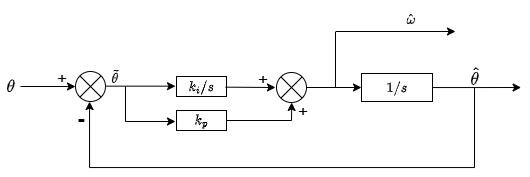
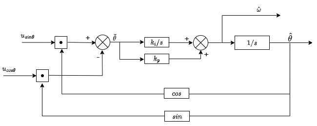
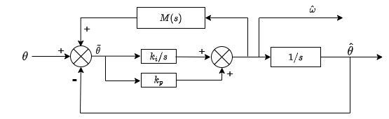

## 一、前言

假设一个信号是受到一些噪声影响时，这个时候往往是使用一个滤波器来获取真实的信号。那么对于转子位置这种信号，无论是否能够直接测量到它，都可以选择滤波系统来完成估计。最常见的莫过于PLL观测器，它本身的开环传递函数是一个II型系统，那么它对斜坡信号是无静差追踪的，而斜坡信号意味着加速度是为零，速度为恒定值。

如图 1-1 所示:

    
     
    <small>图1-1: PLL系统框图</small>

而对于一些采样信号是正余弦信号，这些正余弦信号包含了转子的信号，一般来说，可以通过直接反正切的方式得到当前的电角度，一般来说，采样信号都受到噪声影响，所以更多是将利用上面的结构来完成转子位置的观测。如图 1-2 所示:

    
     
    <small>图1-2: PLL实体框图</small>

将图 1-2 近似表示为图 1-1 是合理的。这个因为当 $\hat{\theta} \rightarrow \theta$ 时，那么便有

$$
\begin{align}
& \lim_{\hat{\theta} \rightarrow \theta} (\sin\theta \cos\hat{\theta} - \cos\theta \sin\hat{\theta}) \\
&= \lim_{\hat{\theta} \rightarrow \theta} \sin(\theta - \hat{\theta}) \\
&= \lim_{\hat{\theta} \rightarrow \theta} (\theta - \hat{\theta})
\end{align}
$$

因此后续分析均是在图 1-1 的基础上进行。从前面的传递框图可知，其闭环传递函数是一个二阶系统，

$$
H(s) = \frac{k_i + k_p s} {s^2 + k_p s + k_i}
$$

那么可以利用的超调5%的最佳阻尼比0.707和对应的设计带宽得到相应的控制器参数。其中对比标准二阶阻尼比而言，$k_i = \omega_n^2$ 并且 $k_p = 2\zeta\omega_n$ ，那么一般选择最佳阻尼比为 $\zeta = 0.707$，

$$
\begin{align}
k_p = 2 * 0.707\omega_n \\
k_i = \frac {k_p^2} {4*0.707^2}
\end{align} \tag{1-1}
$$ 

## 二、追踪恒定加速度的`PLL`算法

在前面提到，这个系统对于加速度信号及其以上的系统，难以满足其较高的追踪性能，而在一般场景中，加速度恒定或者是加加速度在也比较常见。一个自然的想法是，如果想要对信号追踪更好的话，肯定需要知道更多的信息，如同泰勒展开一样，我们可以去获取它的一阶导数，二阶导数这些信息，一种是从原始信号获取，一种是从滤波后的信息中获取。而一般来说，原始信号具有较多的噪声，直接获取它的高阶信息的话，往往会直接加大噪声影响，所以一种可行的方式就是将观测到的比较可靠的信息放到系统中，从而获取到它的高阶信息。基于这种思想，便有了下面的滤波器

    
     
    <small>图2-1: 带前馈的PLL实体框图</small>

图 2-1 是一种将信号的高阶信息放入到系统的前馈观测器。它主要的设计变换的内容主要是这个 $M(s)$ 如何保证稳定可靠，并且具有较高的相应速度。

在文章中提到一种观测器设计为

$$
M(s) = \frac {s} {k_i (Ts + 1)}
$$

那么它的闭环误差传递函数是

$$
\frac{\theta(s)} {\tilde{\theta}(s)} = \frac {Tk_p s^2 + (Tk_i + k_p)s + k_i} {(T-\frac{k_p}{k_i})s^3 + Tk_p s^2 + (Tk_i + k_p)s + k_i}
$$

其中，$\theta(s)$ 是 $\theta$ 的象函数，$\tilde{\theta}(s)$ 是输入信号的象函数。根据框图可以得到，该系统的开环传递函数是III型系统，可以追踪恒定加速度信号，但是无法高精度追踪变加速度信号。

## 三、追踪恒定加加速度的`PLL`算法

### 3.1 理论设计

若想追踪恒定加加速度信号的话，那么就要构造出开环传递函数是IV型系统。按照图 2-1 ，前馈传递函数设计为

$$
M(s) = \frac {s^2 + s} {\gamma s ^2 + (k_i + k_p)s + k_i}
$$

那么从 $\tilde{\theta}$ 到 $\hat{\omega}$ 的传递函数为

$$
\frac{H{\hat{\omega}}}{H(\tilde{\theta})} = \frac {(\gamma s ^2 + (k_i + k_p)s + k_i)(k_i + k_p s)} {(\gamma - k_p)s^3}
$$

容易看出，这是一个III型系统，那么 $\tilde{\theta}$ 到 $\hat{\theta}$ 的传递函数

$$
\frac{H{\hat{\theta}}}{H(\tilde{\theta})} = \frac {(\gamma s ^2 + (k_i + k_p)s + k_i)(k_i + k_p s)} {(\gamma - k_p)s^4}
$$

可以看到，它是一个IV型系统，对于 $\frac{1}{6}\alpha t^3$ 以下的信号都可以满足追踪。那么闭环传递函数为

$$
\frac{H(\hat{\theta})}{H(\theta)} = \frac{\gamma k_p s^3 + (k_i \gamma + k_i k_P + k_p^2)s^2 + (2k_i k_p + k_i^2)s + k_i^2}{(\gamma - k_p)s^4 + k_p \gamma s^3 + (k_i \gamma + k_i k_p + k_p^2)s^2 + (2k_i k_p + k_i^2)s + k_i^2}.
$$

那么有

$$
\frac{H(\tilde{\theta})}{H(\theta)} = 1 - \frac{H(\hat{\theta})}{H(\theta)} = \frac{(\gamma - k_p) s^4}{(\gamma - k_p)s^4 + k_p \gamma s^3 + (k_i \gamma + k_i k_p + k_p^2)s^2 + (2k_i k_p + k_i^2)s + k_i^2}.
$$

对于 $\frac{1}{6}\alpha t^3$ 信号，它的拉氏变换为:

$$
\frac{\alpha}{s^4}
$$

应用终值定理有

$$
\begin{align}
&\lim_{s \rightarrow 0}\frac{H(\tilde{\theta})} {H(\theta)} \\
& = \lim_{s \rightarrow 0} s \cdot \frac{(\gamma - k_p) s^4}{(\gamma - k_p)s^4 + k_p \gamma s^3 + (k_i \gamma + k_i k_p + k_p^2)s^2 + (2k_i k_p + k_i^2)s + k_i^2} \cdot \frac{\alpha}{s^4} \\
& = 0
\end{align}
$$

可以看出，它对于三阶信号是稳定跟踪的，而对于四阶以上的信号，由于它在泰勒级数中占比比较小，所以影响不大。

### 3.2 参数确定

从传递函数可以看出，先决条件是 $\gamma \ge k_p$ ，而原文作者仿真绘制了一个三维空间，图像中表示，如果使用不同的参数来绘制其带宽的话，其中 $\gamma$ 和 $k_p$ 之间呈现一侧的马鞍面的关系，即存在着一条线，在条曲线上，其带宽能取得高值，即 $\gamma \geq c + k_p$ 时是比较高的，原文建议 c 取值为 23.6.

那么根据式 (1-1) ，可以得到参数 $\gamma$ 与带宽之间的关系为

$$
\gamma = 0.0935\omega_n + 53
$$

那么根据之前的参数关系有

$$
k_p = \gamma - 23.6
$$

$$
k_i = \frac{k_p^2 }/ {4 \plus 0.707^2}
$$

## 参考文献

1. [Angle Tracking Observer with Improved Accuracy for Resolver-to-Digital Conversion](assets/Angle Tracking Observer with Improved Accuracy for Resolver-to-Digital Conversion.pdf)